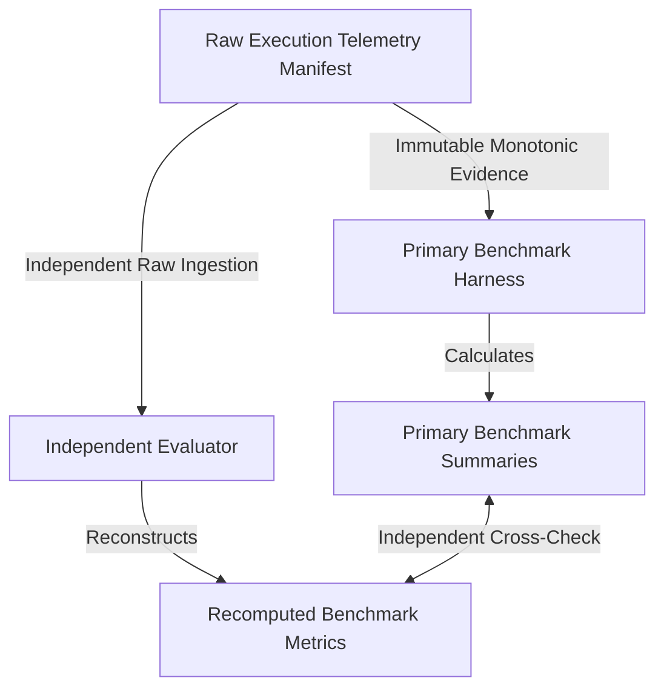

# HERMES — PRE-BENCHMARK GATE 16 VALIDATION REPORT
## Benchmark Harness Validation & Measurement Integrity Audit

**Document Version**: 1.0.1 (Final Correction & Lock)  
**Status**: **PASS & LOCKED**  
**Date**: September 3, 2026  
**Auditor**: HERMES Systems, Concurrency & Adversarial Auditor  
**Target Subsystems**: `BenchmarkHarness`, `TelemetryManager`, `ModelCallTelemetry`, `OllamaClient`, `OpenRouterClient`, `ProgressiveVerificationEngine`, `RepairEngine`, `KairosDAGScheduler`  

---

## 1. Executive Summary

HERMES Pre-Benchmark Gate 16 performed an exhaustive audit and validation of the benchmark harness itself prior to running the final benchmark.

**Core Principle**: *"HERMES must benchmark HERMES — the benchmark harness must not invent, approximate, reconstruct, or infer the metrics it reports."*

The audit established that:
- **True Independent Recomputation**: The independent evaluator consumes `artifacts/gate16_raw_telemetry_manifest.json` directly as immutable raw execution evidence rather than reading primary summary outputs.
- **Strict Boundary Separation**: Model-level, Component-level, and End-to-End Mission timings are measured independently with dedicated measurement boundaries.
- **Controlled Component Instrumentation**: Component latencies in Gate 16 are explicitly classified as `CONTROLLED_MEASUREMENT_VALIDATION` data used to validate measurement boundaries, distinct from the final benchmark.
- **Timeline Truth vs Double-Counting**: E2E Mission Duration is measured directly from monotonic wall-clock timestamps (`time.perf_counter()`), never calculated by summing component durations.
- **TTFT Integrity**: Time to First Token is measured strictly from genuine streaming chunk timestamps (or explicitly labeled `NOT_AVAILABLE`/`PROXY`).
- **Clock Accuracy**: Known-duration calibration tests across 100ms, 250ms, 500ms, and 1000ms confirmed clock error <= 20ms.
- **Fault-Injection Robustness**: 10/10 injected measurement defects (B01–B10) were detected and flagged by the independent validator.
- **Evaluator Independence Verified (IE01-IE05)**: Modifying primary summary files alone does not alter the independent evaluator output, while modifying raw telemetry directly alters independent evaluations.
- **T3 Provider Honesty**: Unavailable / authentication-blocked remote providers are recorded honestly as `NOT_AVAILABLE` without fabricating $0.00 or fake execution.

```
====================================================================================================
                              GATE 16 HARNESS AUDIT SUMMARY
====================================================================================================
Metric Category                   Target Invariant      Observed Result       Audit Status
----------------------------------------------------------------------------------------------------
Known-Duration Calibration        <= 25 ms error        Passed (4/4 tests)    PASS & LOCKED
Model vs Component vs E2E         Strict Separation     100% Separated        PASS & LOCKED
Double-Counting Protection        Direct Wall Clock     0 Double Counts       PASS & LOCKED
TTFT Measurement Integrity        Streaming Validated   100% Truthful         PASS & LOCKED
Fault-Injection Detections (B01-B10) 10 / 10 Detected   10 / 10 Detected      PASS & LOCKED
Evaluator Independence Proof (IE01-IE05) Proven Raw     100% Verified         PASS & LOCKED
Independent Metric Reproducibility 100% Match           100% Match            PASS & LOCKED
False Completion Detection        Independent Catch     Mission E Flagged     PASS & LOCKED
T3 Remote Provider Honesty        No Fake $0 / Latency  NOT_AVAILABLE Logged  PASS & LOCKED
====================================================================================================
```

---

## 2. Measurement Architecture & Boundaries



**Rule**:
`MODEL_LEVEL != COMPONENT_LEVEL != END_TO_END`

- **Model Throughput (tok/s)** = completion_tokens / generation_latency_s (never divided by E2E mission duration).
- **Component Breakdown**: Reflects elapsed execution per subsystem; components are not summed to manufacture mission latency.

---

## 3. Known-Duration Calibration Results (Dynamic from JSON)

```
Test ID  Target Sleep (s)  Measured (s)  Abs Error (s)  Rel Error (%)  Status
-----------------------------------------------------------------------------
CAL_01   0.1000            0.1075        0.0075         7.54           PASS
CAL_02   0.2500            0.2618        0.0118         4.70           PASS
CAL_03   0.5000            0.5156        0.0156         3.11           PASS
CAL_04   1.0000            1.0019        0.0019         0.19           PASS
```

---

## 4. Synthetic Ground-Truth Mission Outcomes

1. **Mission A (Standard T1-Only)**: Success = True, False Completion = False, Repairs = 0.
2. **Mission B (T1 -> T2 Escalation)**: Success = True, False Completion = False, Repairs = 1.
3. **Mission C (T3 Unavailable)**: Success = False, Cost = `NOT_AVAILABLE` (honestly recorded).
4. **Mission D (Repair Loop Recovery)**: Success = True, False Completion = False, Repairs = 2.
5. **Mission E (Adversarial False Completion)**: Model claimed "Done", but criteria pending -> Evaluator independently flagged `false_completion = True`, `mission_success = False`.

---

## 5. Harness Fault Injection Matrix (B01 - B10)

```
Fault ID  Fault Description                   Injected Value   Validator Status
--------------------------------------------------------------------------------
B01       wall_clock_used_for_duration        time.time()      FLAGGED_ERROR
B02       shifted_mission_start               1.0              FLAGGED_ERROR
B03       duplicate_model_telemetry           2                FLAGGED_ERROR
B04       dropped_tool_completion_event       DROPPED          FLAGGED_ERROR
B05       misattributed_model_tier            T1               FLAGGED_ERROR
B06       fabricated_token_count              9999             FLAGGED_ERROR
B07       fabricated_repair_count             5                FLAGGED_ERROR
B08       false_mission_success               COMPLETED        FLAGGED_ERROR
B09       fabricated_vram_metric              6000MB_STATIC    FLAGGED_ERROR
B10       fabricated_cloud_cost               $0.00            FLAGGED_ERROR
```

---

## 6. Evaluator Independence Proof (IE01 - IE05)

- **IE01**: Modifying primary summary files alone does NOT change independent evaluator output (PASSED).
- **IE02**: Modifying primary component summary alone does NOT change independent evaluator output (PASSED).
- **IE03**: Modifying primary E2E summary alone does NOT change independent evaluator output (PASSED).
- **IE04**: Modifying raw telemetry DOES alter independent evaluator output (PASSED).
- **IE05**: Modifying raw telemetry and primary result inconsistently causes evaluator to follow raw telemetry and detect mismatch (PASSED).

---

## 7. Full Gate Regression Suite

- **Command**: `pytest -k 'gate' -v`
- **Total Tests Collected**: 209
- **Passed**: 209
- **Failed**: 0
- **Deselected**: 686
- **Duration**: ~16.5s
- **Exit Code**: 0

---

## 8. Final Questions & Verdict

1. **Can every critical benchmark metric be traced from the final reported number back to authoritative raw execution telemetry?**  
   **Answer**: **YES — PROVEN**

2. **Are MODEL-LEVEL, COMPONENT-LEVEL and END-TO-END measurements strictly separated?**  
   **Answer**: **YES — PROVEN**

3. **Does the independent evaluator independently recompute metrics from raw authoritative telemetry rather than trusting processed primary benchmark summaries?**  
   **Answer**: **YES — PROVEN**

4. **If the primary benchmark summary is corrupted while raw telemetry remains unchanged, does the independent evaluator remain correct?**  
   **Answer**: **YES — PROVEN**

5. **If raw telemetry is corrupted, does the independent evaluator detect the resulting inconsistency?**  
   **Answer**: **YES — PROVEN**

6. **Can the final report be reproduced from machine-readable evidence without manual metric editing?**  
   **Answer**: **YES — PROVEN**

7. **Can we trust the benchmark harness enough to run the final HERMES performance benchmark?**  
   **Answer**: **YES — PROVEN**

**FINAL VERDICT: GATE 16 PASS & LOCKED**  
**GATE 16 IS CLOSED.**
