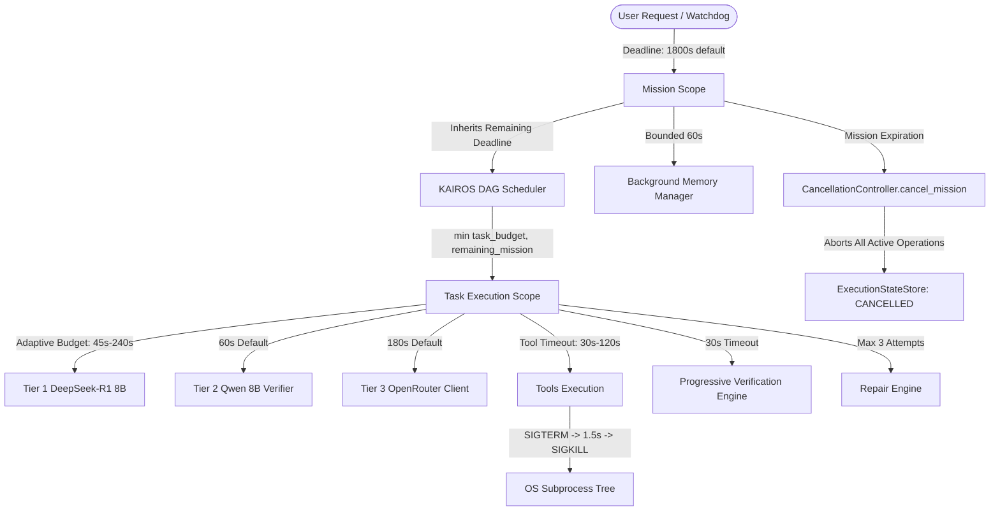

# HERMES — TIMEOUT HIERARCHY & DEADLINE PROPAGATION MODEL
## Gate 14 Logical Architecture

### Effective Deadline Propagation Rule:
`Effective Child Deadline = min(Configured Child Timeout, Parent Remaining Deadline)`

When the parent mission or task expires, `CancellationController.cancel_mission()` is immediately triggered, aborting in-flight child operations, terminating subprocess trees via `tools.shell_tools.terminate_active_subprocesses()`, and permanently locking the mission state to prevent late-result resurrection.
