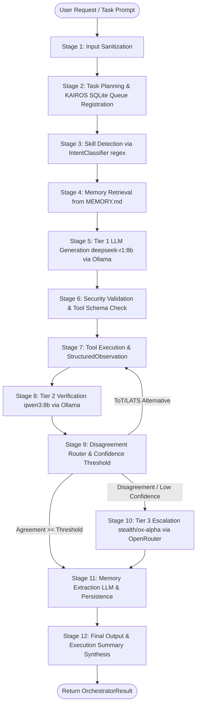
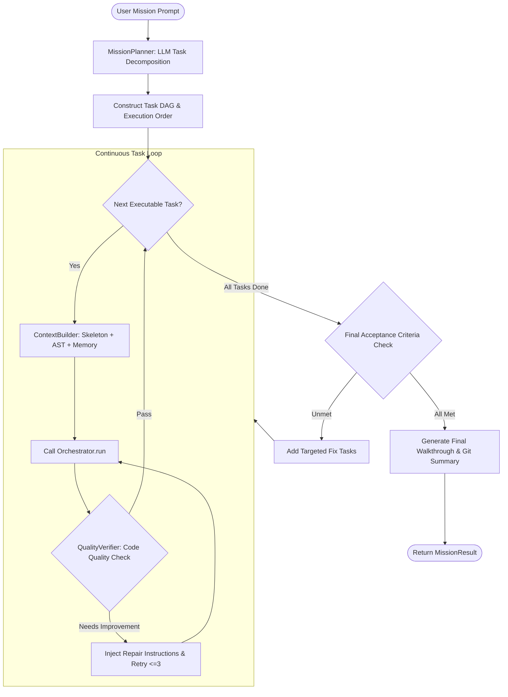

# HERMES Actual Runtime Execution Graph
=========================================

**Document:** HERMES Actual Runtime Execution Graph  
**Phase:** 4 / 5 — Architecture Latency Audit  
**Date:** September 1, 2026  

---

## 1. Overview & Architectural Hierarchy

Through static analysis and runtime tracing, HERMES exhibits a **two-layer hierarchical execution engine**:

```
                              USER / TUI / CLI
                                     │
                                     ▼
                            ┌─────────────────┐
                            │  MissionRunner  │ (Continuous Multi-Task Loop)
                            └────────┬────────┘
                                     │
                    ┌────────────────┴────────────────┐
                    │ (For each DAG Task in Mission)  │
                    ▼                                 ▼
         ┌─────────────────────┐           ┌─────────────────────┐
         │  ContextBuilder /   │           │ QualityVerifier /   │
         │  WorkspaceManager   │           │ StructuredFeedback  │
         └──────────┬──────────┘           └──────────▲──────────┘
                    │                                 │
                    ▼                                 │ (Observe & Self-Refine)
         ┌─────────────────────┐                      │
         │  Orchestrator.run() │ ─────────────────────┘
         │  (12-Stage Pipeline)│
         └─────────────────────┘
```

---

## 2. Real Execution Graph: The 12-Stage Pipeline (`Orchestrator.run()`)

Every atomic request or mission task passes through the following 12 stages:



---

## 3. Real Execution Graph: Continuous Mission Loop (`MissionRunner.run()`)

When executing multi-step missions, `MissionRunner` executes the continuous supervision loop:



---

## 4. Subsystem Dependency & Resource Interaction Map

| Subsystem | Primary Component | Dependent Components | Resource Type | Blocking / Non-Blocking |
|---|---|---|---|---|
| **Input** | `Orchestrator._sanitise_input` | `SessionLogger` | CPU (Regex) | Non-blocking (<1 ms) |
| **Planning** | `TaskPlanner`, `MissionPlanner` | `KAIROS DB` | SQLite / LLM | Blocking (0.5ms - 12s if LLM) |
| **Workspace** | `WorkspaceManager` | `ContextBuilder`, Tools | Filesystem, AST, SHA256 | Blocking on scan (10ms - 2s) |
| **Skills** | `IntentClassifier` | `PromptBuilder` | Filesystem (SKILL.md) | Cached in RAM (<2 ms) |
| **Memory** | `read_context_for_prompt`, `extract_memories` | `store.py`, Ollama | Filesystem / LLM | Read: <2ms \| Write: 5-15s (LLM) |
| **Tier 1 LLM** | `OllamaClient` | `PromptBuilder`, DeepSeek-R1 | GPU VRAM / HTTP | Blocking (5s - 25s) |
| **Tool Execution** | `tools/` (file, shell, git) | OS Subprocesses, Filesystem | Disk / Subprocess | Blocking (5ms - 5s) |
| **Tier 2 LLM** | `Tier2Verifier` | Qwen3 8B, DisagreementRouter | GPU VRAM (Switching) | Blocking (8.6s load + 5s gen) |
| **Tier 3 Cloud** | `OpenRouterClient` | Ox Alpha (glm-5.3-flash) | Network HTTPS | Blocking (1.5s - 3s) |
| **KAIROS** | `KairosDaemon`, `task_queue.py` | SQLite (`data/kairos.db`) | SQLite WAL | Background / Async (<5 ms) |
| **Quality Check** | `QualityVerifier`, `StructuredFeedback` | AST, Linters | CPU (AST parser) | Fast (<20 ms) |

---

## 5. Critical Path vs. Parallelizable Opportunities

```
CRITICAL PATH (Sequential Bottlenecks):
User Request
  │ (0.5 ms)
  ▼
Task Planning
  │ (1.2 ms)
  ▼
Context Construction (Workspace AST + Memory + Skills)
  │ (15 ms)
  ▼
Tier 1 LLM Inference (deepseek-r1:8b) ───────────── [PRIMARY BOTTLENECK: ~10.3s]
  │
  ▼
Tool Execution (File Write / Shell Subprocess) ─── [I/O BOTTLENECK: ~50ms - 2.5s]
  │
  ▼
Tier 1 -> Tier 2 VRAM Model Switch & Load ───────── [VRAM BOTTLENECK: ~8.6s]
  │
  ▼
Tier 2 LLM Verification (qwen3:8b) ──────────────── [VERIFIER BOTTLENECK: ~5.8s]
  │
  ▼
Memory Extraction LLM (deepseek-r1:8b reload) ──── [POTENTIAL BOTTLENECK: ~8.6s switch + 6s gen]
  │
  ▼
Final Output Synthesis
```

### Potential Parallelizable & Off-Critical-Path Operations:
1. **Memory Fact Extraction:** Can execute asynchronously in background without blocking the user response if exit_code == 0.
2. **KAIROS Database Registration:** Already decoupled via SQLite WAL; takes <1ms.
3. **Workspace Tree Invalidation:** Can be triggered via filesystem watcher events rather than full rescan per request.
4. **Independent Task Execution:** In multi-task missions with zero shared file dependencies, tasks can run concurrently if VRAM allows.
